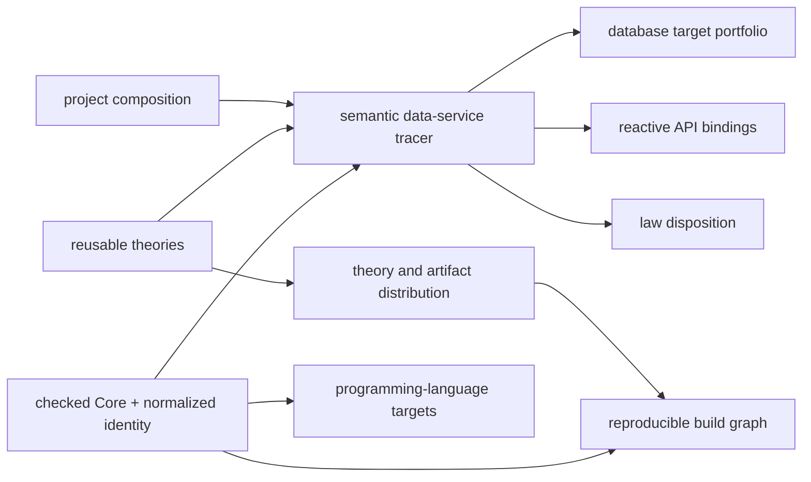
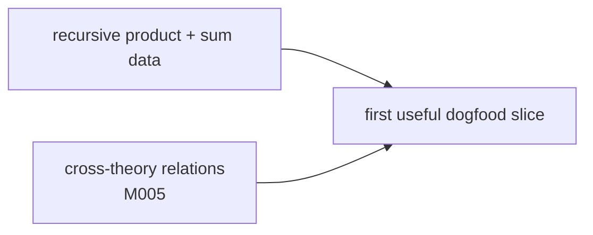

# BANG capability dependency map

This is the schedulable dependency projection for near-term product capabilities. It is not the full theory-interaction graph and does not claim that a DAG proves semantic compatibility or evaluator termination. [BANG-PROJECT-DIRECTION.md](BANG-PROJECT-DIRECTION.md) remains the source for the long-term capability set; active mission contracts define observable acceptance.

```mermaid
flowchart LR
    M000["M000 · executable Core → Effect spine<br/>complete"]
    M001["M001 · refined domain value<br/>complete"]
    M002["M002 · one theory + finite model<br/>complete"]
    M003["M003 · generated algebraic law suite<br/>complete"]
    M004["M004 · coalgebraic state preservation<br/>complete"]
    M005["M005 · Account ↔ Ledger bridge law<br/>complete"]
    M005A["M005A · first Core dogfood<br/>complete"]
    M006["M006 · effect + capability boundary<br/>complete"]
    M007["M007 · graded evidence report<br/>complete"]
    M008["M008 · runtime trace observation<br/>complete"]
    M009["M009 · Rust portability projection<br/>complete"]
    M010["M010 · replayable evidence manifest<br/>complete"]
    M011["M011 · bounded solver-backed relational obligation<br/>complete"]
    M012["M012 · accumulated system report<br/>complete"]
    M013["M013 · Account source notation<br/>complete"]
    M014["M014 · cohesive system CLI<br/>complete"]
    M015["M015 · entity ownership and typed messages<br/>complete"]
    M016["M016 · kernel-proof provider<br/>complete"]
    M017["M017 · Gleam/BEAM actor realization<br/>complete"]
    M018["M018 · single-use capability quantity<br/>complete"]
    M019["M019 · real BANG self-check<br/>complete"]
    M020["M020 · persistent family ledger<br/>complete"]
    M021["M021 · construct-addressed normalization<br/>complete"]
    M022["M022 · versioned theory explanation<br/>complete"]
    M023["M023 · realization classification<br/>complete"]
    M024["M024 · bounded two-owner channel trace<br/>complete"]
    M025["M025 · single-authority project composition<br/>complete"]
    M026["M026 · persistent reactive semantic database<br/>complete"]
    M027["M027 · cross-entity atomic transfer<br/>complete"]
    M028["M028 · versioned semantic-service evolution<br/>complete"]
    M029["M029 · second-domain theory portability<br/>complete"]
    M030["M030 · local versioned theory package<br/>complete"]
    M031["M031 · fresh two-target exact-one qualification<br/>complete"]
    M032["M032 · objective-relative realization planning<br/>complete"]
    M033["M033 · selected realization assembly<br/>complete"]
    M034["M034 · continuous evidence invalidation<br/>complete"]
    M035["M035 · external extension boundary<br/>complete"]
    M036["M036 · second-domain realization portability<br/>complete"]
    M037["M037 · full compiler candidate<br/>active"]


    M000 --> M001 --> M002 --> M003
    M001 --> M004
    M002 --> M005
    M004 --> M005
    M005 --> M005A
    M000 --> M005A
    M005A --> M006
    M003 --> M007
    M005 --> M007
    M006 --> M007
    M004 --> M008
    M007 --> M008
    M001 --> M009
    M007 --> M009
    M007 --> M010
    M010 --> M011
    M005 --> M012
    M006 --> M012
    M007 --> M012
    M008 --> M012
    M009 --> M012
    M010 --> M012
    M011 --> M012
    M012 --> M013
    M012 --> M014
    M013 --> M014
    M004 --> M015
    M006 --> M015
    M008 --> M015
    M010 --> M016
    M011 --> M016
    M012 --> M016
    M014 --> M016
    M015 --> M017
    M006 --> M018
    M007 --> M018
    M015 --> M018
    M007 --> M017
    M005A --> M019
    M007 --> M019
    M014 --> M019
    M014 --> M020
    M015 --> M020
    M019 --> M020
    M013 --> M021
    M019 --> M021
    M020 --> M021
    M018 --> M022
    M019 --> M022
    M021 --> M022
    M018 --> M023
    M022 --> M023
    M015 --> M024
    M017 --> M024
    M021 --> M024
    M022 --> M024
    M023 --> M024
    M014 --> M025
    M018 --> M025
    M021 --> M025
    M022 --> M025
    M023 --> M025
    M024 --> M025
    M015 --> M026
    M018 --> M026
    M020 --> M026
    M021 --> M026
    M022 --> M026
    M025 --> M026
    M005 --> M027
    M011 --> M027
    M012 --> M027
    M016 --> M027
    M025 --> M027
    M026 --> M027
    M021 --> M028
    M022 --> M028
    M025 --> M028
    M027 --> M028
    M021 --> M029
    M022 --> M029
    M028 --> M029
    M022 --> M030
    M029 --> M030
    M017 --> M031
    M018 --> M031
    M022 --> M031
    M023 --> M031
    M030 --> M031
    M023 --> M032
    M025 --> M032
    M030 --> M032
    M031 --> M032
    M032 --> M033
    M033 --> M034
    M034 --> M035
    M035 --> M036
    M036 --> M037

```

| Capability                               | User-feelable claim                                                                                                                | Requires                                                                                                        | First tracer | Status   |
| ---------------------------------------- | ---------------------------------------------------------------------------------------------------------------------------------- | --------------------------------------------------------------------------------------------------------------- | ------------ | -------- |
| Core-to-target spine                     | Generate and type-check one independent Effect port                                                                                | —                                                                                                               | M000         | complete |
| refined domain value                     | Construct `Balance`, reject invalid values                                                                                         | Core-to-target spine                                                                                            | M001         | complete |
| theory and finite model                  | Ask whether one finite model satisfies one law                                                                                     | refined domain value                                                                                            | M002         | complete |
| algebraic law suite                      | Find and minimize a law counterexample                                                                                             | theory and finite model                                                                                         | M003         | complete |
| coalgebraic state preservation           | Reject a transition that breaks an invariant                                                                                       | refined domain value                                                                                            | M004         | complete |
| cross-theory bridge                      | Expose an Account/Ledger disagreement in domain terms                                                                              | theory/model + state preservation                                                                               | M005         | complete |
| first Core dogfood                       | Detect recursive `BridgeTerm` drift in the BANG compiler                                                                           | bridge + algebraic data                                                                                         | M005A        | complete |
| effectful capability boundary            | Require debit authority and typed failure                                                                                          | spine + state preservation                                                                                      | M006         | complete |
| graded evidence                          | Report sampled evidence with scope, trust, and invalidators                                                                        | produced evidence classes                                                                                       | M007         | complete |
| runtime observation                      | Classify one real operation trace against checked Core                                                                             | state preservation + evidence                                                                                   | M008         | complete |
| target portability                       | Reuse Core in a Rust conformance boundary                                                                                          | stable value Core + evidence                                                                                    | M009         | complete |
| replayable evidence                      | Reload, verify, and replay one saved property observation                                                                          | graded evidence + state preservation                                                                            | M010         | complete |
| bounded relational solver                | Ask a bounded transfer-conservation question and report solver output without claiming proof                                       | cross-theory bridge + explicit bounds                                                                           | M011         | complete |
| accumulated system report                | Select one Account/Ledger system and retain each checked contract and evidence scope                                               | checked Core + qualified evidence                                                                               | M012         | complete |
| Account source notation                  | Author one Account behavior once and lower it to stable checked Core                                                               | state preservation + capability + accumulated report                                                            | M013         | complete |
| cohesive system CLI                      | Run one selected Account/Ledger report through a shipped command                                                                   | accumulated report + Account source notation                                                                    | M014         | complete |
| entity ownership and typed messages      | Create one Account entity and send typed withdrawals without a state argument                                                      | state preservation + capability boundary + runtime observation                                                  | M015         | complete |
| kernel-proof provider                    | Check one unbounded relational theorem and one explicit refutation in Lean                                                         | replayable evidence + normalized relational obligation + accumulated report + cohesive CLI                      | M016         | complete |
| Gleam/BEAM actor realization             | Run one typed Account actor under a real supervisor and report restart semantics                                                   | entity ownership + graded evidence                                                                              | M017         | complete |
| single-use capability quantity           | Issue one exact-one grant, consume it before one execution, and reject reuse without restoring state                               | effectful capability boundary + graded evidence + entity ownership                                              | M018         | complete |
| real BANG self-check                     | Produce fresh evidence against one real BANG compiler component through a shipped command                                          | first Core dogfood + graded evidence + cohesive CLI                                                             | M019         | complete |
| persistent family ledger                 | Use one persistent balanced family ledger through separate shipped CLI invocations                                                 | cohesive CLI + entity identity + real self-check                                                                | M020         | complete |
| construct-addressed normalization        | Explain changed and reusable TinyBank conclusions after one semantic edit                                                          | Account source notation + real self-check + persistent family ledger                                            | M021         | complete |
| versioned theory explanation             | Explain why exact-one capability execution applies or fails through an independent artifact consumer                               | single-use capability + real self-check + construct-addressed normalization                                     | M022         | complete |
| realization classification               | Classify Effect and Gleam implementations against derived exact-one obligations with honest evidence                               | versioned theory explanation + single-use capability evidence                                                   | M023         | complete |
| bounded two-owner channel trace          | Explain ordered, duplicated, reordered, and dropped deliveries without conflating order, causality, or coordination                | entity ownership + actor limitations + normalization + theory explanation + realization classification          | M024         | complete |
| single-authority project composition     | Name TinyBank sources, theories, realization candidates, targets, channel analysis, and evidence policy once                       | cohesive CLI + exact-one evidence + normalization + theory explanation + classification + channel trace         | M025         | complete |
| persistent reactive semantic database    | Derive one persistent typed command, query, and subscription service from one checked TinyBank model                               | entity messages + exact-one capability + persistence + normalization + theory explanation + project composition | M026         | complete |
| cross-entity atomic transfer             | Transfer between two Accounts atomically and observe both balances plus preserved TotalFunds reactively                            | bridge composition + relational obligation + proof evidence + project composition + semantic database           | M027         | complete |
| versioned semantic-service evolution     | Evolve one persistent transfer service with dependency-scoped reuse or typed rejection before atomic cutover                       | normalization + theory explanation + project composition + cross-entity transfer                                | M028         | complete |
| second-domain theory portability         | Apply one unchanged exact-one theory to TinyBank and Inventory with positive and negative explanations                             | normalization + versioned theory explanation + completed TinyBank reference                                     | M029         | complete |
| local versioned theory package           | Resolve, verify, lock, and apply one checked exact-one theory package across TinyBank and Inventory                                | versioned theory explanation + second-domain theory portability                                                 | M030         | complete |
| fresh two-target exact-one qualification | Execute the same packaged exact-one requirement through fresh Effect and supervised Gleam probes with target-specific evidence     | actor realization + single-use capability + theory explanation + classification + local theory package          | M031         | complete |
| objective-relative realization planning  | Match explicit operational objectives against fresh qualified candidates and return selected, incomparable, or no-plan results     | realization classification + project composition + local theory package + fresh qualification                   | M032         | complete |
| selected realization assembly            | State one objective, receive one local escript that runs without BANG, with every assembled byte identified                        | objective-relative planning + actor realization + fresh qualification                                           | M033         | complete |
| continuous evidence invalidation         | Change one material and learn exactly which published evidence is invalidated, then requalify only that closure                    | objective-relative planning + actor realization + fresh qualification + selected realization assembly           | M034         | complete |
| external extension boundary              | Consume BANG's published schemas from one process outside the workspace and receive one typed verdict                              | selected realization assembly + continuous evidence invalidation                                                | M035         | complete |
| second-domain realization portability    | Carry one Clinic operation through qualification, planning, Gleam assembly, audit, and external consumption without TinyBank drift | second-domain theory portability + external extension boundary                                                  | M036         | complete |
| full compiler candidate                  | Run the committed Clinic path through one clean-checkout command and receive one honest accumulated report                         | accumulated report + Clinic portability + external extension boundary                                           | M037         | active   |

M025 is complete through `bang project examples/tiny-bank/project.json`. Its tracer composes one project-owned source list and preserves all evidence distinctions.

[Decision 0011](decisions/0011-semantic-data-service-exploration.md) defines the product exploration. [M026](design-specs/M026-semantic-database.md) completes its first vertical tracer.

M026 is complete through `bang database examples/tiny-bank/database/account.json`. It derives one SQLite schema and one typed Effect provider and client boundary. It runs one persistent reactive journey and reports each law's enforcement mechanism.

[M027](design-specs/M027-cross-entity-transfer.md) is complete through `bang database examples/tiny-bank/database/transfer.json`. It composes explicit representation links with a reusable transfer-preservation obligation. The journey uses an independent handler, one atomic SQLite transaction, and derived reactive observations.

[M028](design-specs/M028-versioned-semantic-evolution.md) is complete through `bang evolve examples/tiny-bank/evolution/transfer-compatible.json`. It reuses the unchanged selected service closure, M016 and M018 evidence, generated SQL and Effect bindings, and persisted Account rows. The invariant-change fixture is rejected with its invalidating addresses before version cutover.

[M029](design-specs/M029-second-domain-theory-portability.md) is complete through `bang explain examples/inventory/theories/exact-one-reservation.json`. The unchanged exact-one theory derives the same four obligation identities for TinyBank and Inventory. The unbounded Inventory requirement receives no obligations, and an unknown address fails without a partial report.

[M030](design-specs/M030-local-theory-package-consumption.md) is complete through `bang explain examples/inventory/theories/packaged-exact-one.json`. The selection pins a local package by identity, version, semantic digest, and evaluator identity. BANG writes a deterministic theory lock only after package verification and evaluator agreement.

[M031](design-specs/M031-two-target-exact-one-qualification.md) is complete through `bang classify examples/tiny-bank/realizations/two-qualified-exact-one.json`. Effect and supervised Gleam/BEAM execute fresh exact-one probes against the same packaged requirement. Each target receives an independent evidence record and qualifies only from that record; actor restart invalidates the old grant without moving lifecycle policy into Core.

[M032](design-specs/M032-objective-relative-realization-planning.md) is complete through `bang plan examples/tiny-bank/plans/supervised-exact-one.json`. BANG reruns both target probes, maps checked evidence into target-owned planning contributions, and matches only explicit objectives. The command returns one selected plan, explicit incomparable plans, or a typed no-plan result. It publishes the fresh qualification and plan closure atomically.

[M033](design-specs/M033-selected-realization-assembly.md) is complete through `bang assemble examples/tiny-bank/assemblies/supervised-exact-one.json`. BANG stages the selected M032 plan, binds the M031-qualified Gleam boundary by digest, exports a canonical escript with pinned toolchain materials, and checks one separate-process observation against M031 evidence. The published artifact runs through `escript` without BANG; the assembly record identifies every generated, assembled, third-party, compiled, and toolchain material.

[M034](design-specs/M034-evidence-invalidation.md) is complete through `bang audit tiny-bank-supervised-exact-one`. The audit inventories every recorded material of one published assembly closure, recomputes each digest, and classifies every member by its equality class: decoded materials compare semantically, opaque custody bytes compare exactly, and derived members resolve through their owning producer. Changed materials retire records transitively over recorded citation edges only, requalification reruns only retired producers while preserving evidence classes, closure parity is verified before any commit, and the fresh closure republishes in one atomic transaction. Typed failures cover unsafe or unknown assembly identities, unreadable records, missing or unreadable materials, digest failures, comparison failures, and requalification stages.

[M035](design-specs/M035-external-extension-boundary.md) is complete through `bang export-schemas`. BANG publishes one versioned schema set under `dist/schemas/1/` — a digest-pinned manifest, three JSON Schema documents generated from the live producer Schemas, and consumer types with strict decoders — replacing any same-version publication atomically and byte-identically. A focused journey runs one consumer process in a temporary directory outside the workspace that imports only publication entries and host built-ins, verifies every recorded SHA-256 custody digest, strictly decodes a published theory lock and target evidence record, and prints one typed verdict; eight negative fixtures cover tampered materials, unsupported versions, missing or altered publication files, malformed records, foreign imports, and disagreeing records.

[M036](design-specs/M036-second-domain-realization-boundary-portability.md) is complete at protected revision `5e45b1242c74c6a5306b0817ddd08814b68292a9`. Checked Core selects the Clinic shape and identities. Effect and Gleam own separate probes. Planning selects Gleam, assembly retains the qualified bytes, and audit requests zero requalifications. The external consumer checks strict decode and custody. Clean runs preserve all Clinic and TinyBank compatibility bytes.

[M037](design-specs/M037-full-compiler-candidate.md) is active. One root Bun command will compose the committed Clinic chain, artifact-only execution, audit, schema publication, and external consumer. One accumulated report will bind current sources without copying their evidence grades. Historical mission citations are not current report evidence. The six-family scorecard will not claim universal unification or author-independent Clinic design.

## Exploratory ecosystem frontier

The semantic data-service tracer can test the model through one usable application path. Other ecosystem branches remain independent.

The provisional compiler horizon remains in [BANG-PROJECT-DIRECTION.md](BANG-PROJECT-DIRECTION.md). [Decision 0010](decisions/0010-surface-inference-and-full-compiler-horizon.md) records its acceptance signals.

## Dogfood dependency

The first useful self-application is a BANG declaration for one part of `CoreDocument`, projected into a kit that the existing `@bang/core` implementation must conform to. It depends on two capabilities not yet demonstrated together:

M005A completed this slice. It specifies the real recursive `BridgeTerm` shape
and evaluates the existing Core decoder through a generated conformance port.
Merely naming a toy realization “BANG” would be ceremonial self-reference, not
dogfooding.

## North-star pressure test

The sibling Agent Engine / ADLC-OS project is an architectural pressure test, not an MVP dependency or scheduled BANG mission. It asks whether one BANG system contract could eventually compose:

- organization, Project, Worker, Actor, Session, Work, Capability, Grant, Evidence, and Memory theories;
- actor and workflow transitions with ownership, supervision, cancellation, and bounded resources;
- process laws over messages, handoffs, effects, and observable traces;
- policy and capability laws across control, execution, evidence, and infrastructure planes;
- several reasoning projections, including relational model finding, temporal checking, and selective proof;
- Effect service and Layer boundaries whose interpretations may provision or reconcile infrastructure.

This example does not authorize those constructs in Core. A construct still enters only when a current vertical mission needs it and supplies judgments, fixtures, projection behavior, and honest evidence. ADLC-OS succeeds as a north-star case only if its domain meaning stays independent of Effect and infrastructure providers while its selected realization can still be Effect implemented by Effect.
