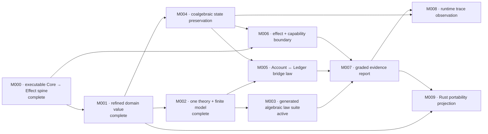

# BANG capability dependency map

This is the schedulable dependency projection for near-term product capabilities. It is not the full theory-interaction graph and does not claim that a DAG proves semantic compatibility or evaluator termination. [BANG-PROJECT-DIRECTION.md](BANG-PROJECT-DIRECTION.md) remains the source for the long-term capability set; active mission contracts define observable acceptance.

| Capability                     | User-feelable claim                                           | Requires                          | First tracer | Status   |
| ------------------------------ | ------------------------------------------------------------- | --------------------------------- | ------------ | -------- |
| Core-to-target spine           | Generate and type-check one independent Effect port           | —                                 | M000         | complete |
| refined domain value           | Construct `Balance`, reject invalid values                    | Core-to-target spine              | M001         | complete |
| theory and finite model        | Ask whether one finite model satisfies one law                | refined domain value              | M002         | complete |
| algebraic law suite            | Find and minimize a law counterexample                        | theory and finite model           | M003         | active   |
| coalgebraic state preservation | Reject a transition that breaks an invariant                  | refined domain value              | M004         | planned  |
| cross-theory bridge            | Expose an Account/Ledger disagreement in domain terms         | theory/model + state preservation | M005         | planned  |
| effectful capability boundary  | Require debit authority and typed failure                     | spine + state preservation        | M006         | planned  |
| graded evidence                | Distinguish structure, tests, runtime checks, and assumptions | produced evidence classes         | M007         | planned  |
| runtime observation            | Monitor one operation protocol over a trace                   | state preservation + evidence     | M008         | planned  |
| target portability             | Reuse Core in a Rust conformance boundary                     | stable value Core + evidence      | M009         | planned  |

Only the active mission may refine an edge or add a prerequisite. Later capabilities are hypotheses until a tracer bullet exercises them.
