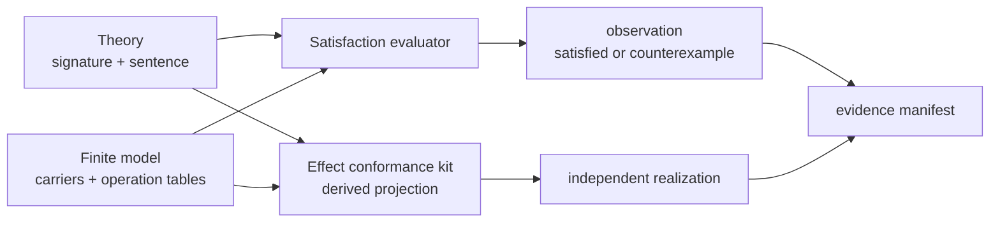

# Mission

BANG can declare one Account Lifecycle theory, determine exhaustively whether a finite model satisfies its idempotent-freeze law, and explain a broken model with a domain-level counterexample.

## User journey

Run `just preview`:

```text
AccountLifecycle signature + freeze-idempotence sentence
  → decode and type-check
  → validate finite carrier and total operation tables
  → enumerate every Status assignment
  → valid model satisfies the law
  → broken model returns Open as a counterexample
  → generate an Effect model port and cases
  → independently written realization conforms
  → emit scoped finite-exhaustive evidence
```

## Semantic boundary



The theory owns vocabulary and laws. A model interprets that vocabulary. Satisfaction is an evaluated relation between one model and the theory's sentences. The generated target kit is a projection and does not own theory truth.

## Core fragment

The theory signature contains:

```text
sort Status
freeze : Status → Status
law freezeIdempotent(status : Status):
  freeze(freeze(status)) = freeze(status)
```

A finite model supplies:

- a non-empty finite carrier for every sort;
- exactly one total, deterministic table for every operation;
- table arguments and results belonging to their declared carriers;
- a reference to the theory it interprets.

Terms are only variables and operation applications. Sentences are only universally quantified equalities over explicit parameters. This is a deliberately small many-sorted equational-logic fragment.

## Satisfaction judgment

For each law parameter assignment from its declared finite carriers, evaluate both terms through the selected model's operation tables:

```text
M, ρ ⊢ left ⇓ a     M, ρ ⊢ right ⇓ b
────────────────────────────────────────
M, ρ ⊨ left = right  iff  a = b

M ⊨ law  iff  every finite assignment ρ satisfies its equality
M ⊨ theory  iff  M satisfies every declared law
```

Enumeration is exhaustive only for the exact declared finite carriers. It is not a proof about other models, unbounded carriers, or the intended real banking domain.

## Reference interpretation

| `Status` | Valid `freeze` | Broken `freeze` |
| -------- | -------------- | --------------- |
| `Open`   | `Frozen`       | `Frozen`        |
| `Frozen` | `Frozen`       | `Open`          |
| `Closed` | `Closed`       | `Closed`        |

The broken model fails first at `status = Open`:

```text
freeze(freeze(Open)) = Open
freeze(Open)         = Frozen
```

The assignment, evaluated left value, and evaluated right value must be retained as structured data before rendering prose.

## Effect projection

The valid system model generates:

- one literal Schema and TypeScript type per finite carrier;
- one host interface for the theory operations;
- deterministic operation-table cases for conformance;
- stable Core declaration IDs in generated names and diagnostics.

A hand-written realization implements `freeze`. The generated cases exhaustively compare it with the selected finite model. This checks realization agreement over the finite table; it does not prove host behavior outside the generated closed carrier.

## Evidence

| Claim                                    | Evidence class             | Scope                                                |
| ---------------------------------------- | -------------------------- | ---------------------------------------------------- |
| valid model satisfies the law            | `finite-exhaustive`        | all three `Status` assignments in the declared model |
| broken model violates the law            | counterexample observation | first failing assignment and evaluated terms         |
| host realization agrees with valid model | runtime conformance        | all three declared operation rows                    |
| theory is universally valid              | unsupported                | other carriers and interpretations were not checked  |

## Acceptance evidence

- positive Core fixture decodes and validates;
- an incomplete operation table is rejected semantically;
- the valid model is reported satisfied after exactly three assignments;
- the broken model reports `status = Open`, left `Open`, right `Frozen`;
- generated Effect output matches a committed snapshot;
- an independent Effect realization type-checks and agrees with every selected-model row;
- evidence records theory, model, law, scope, counterexample, assumptions, and unsupported claims separately;
- `just preview` demonstrates M000 through M002;
- `just verify` passes from a clean checkout in GitHub Actions.

## Foundations and provenance

The signature/sentence/model/satisfaction separation follows Goguen and Burstall's original [institution account](https://courses.grainger.illinois.edu/cs522/sp2016/InstitutionsAbstractModelTheory.pdf). M002 implements one concrete finite equational fragment; it does not implement institution morphisms or claim the general satisfaction condition.

From `lang-bang` at `5b8e032bcffefb23a3a153d3f5cea99050e589c1`, M002 adapts first-class named laws and realization-specific evaluation from `Bang/Witness/LawTest.lean`, but rejects source-language coupling and sampled generators for this finite mission. From `semantic` at `0f6adf892c0ff59d66cd3405afcd9f3509ebde00`, it adapts the explicit theory/realization/evidence separation in `features/0001-inventory-resolution-tracer/spec.md`, while deferring content hashing until stable evidence identities have a consumer.

## Primary uncertainty

Can this minimal typed term and finite-table representation express one useful law without forcing a premature general logic or module calculus?

## Non-goals

- theory morphisms, imports, bridges, or heterogeneous logics;
- predicates beyond equality or terms beyond variables and applications;
- sampling, shrinking, solver dispatch, or proof generation;
- coalgebraic transition semantics or temporal claims;
- content-addressed theory/model identity;
- arbitrary target-code generation;
- surface syntax beyond Core JSON.

## Result

- GitHub clean-run evidence: <https://github.com/phibkro/bang-project/actions/runs/31730449517>
- The valid Account Lifecycle model satisfied `freezeIdempotent` over all three declared assignments.
- The broken model produced structured data for `status = Open`, with left `Open` and right `Frozen`.
- An incomplete operation table was rejected before satisfaction evaluation.
- The generated Effect kit preserved the finite carrier, operation signature, model rows, and Core identities; an independent realization agreed with all three rows.
- The evidence manifest kept finite satisfaction, counterexample observation, and target runtime conformance distinct and left universal proof unsupported.
- Integration exposed and corrected a mission-ownership leak: M000's type-check glob included later TinyBank implementations. Each mission now compiles only its owned generated boundary and consumer.
- The typed variable/application/equality fragment was sufficient for this law. M003 can reuse the normalized law and target port; it must add generation and shrinking without redefining satisfaction.
