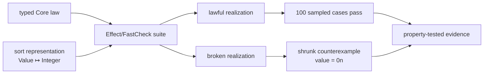

# Mission

BANG can project an integer-addition identity law into an Effect/FastCheck property suite, accept a lawful realization, and shrink a broken realization to the counterexample `value = 0n`.

## User journey

```text
IntegerAddition theory + represented sort
  → Core decode and law typing
  → deterministic Effect model port and property suite
  → lawful independent realization passes 100 generated cases
  → broken realization fails
  → FastCheck shrinks the failure to value = 0n
  → evidence records seed, requested cases, runs, shrinks, and replay path
```

Run `just preview` and inspect `generated/effect/IntegerAdditionProperties.ts` plus `.bang/evidence/M003.json`.

## Core extension

M002 sorts were abstract and received carriers from finite models. M003 adds an optional explicit representation to a theory sort:

```json
{
  "id": "Value",
  "representation": { "kind": "builtin", "type": "Integer" }
}
```

The theory is:

```text
sort Value represented by Core Integer
zero : → Value
add  : Value × Value → Value

law rightIdentity(value : Value):
  add(value, zero()) = value
```

The representation is part of the theory declaration because the generated target suite requires a concrete value generator. It does not change M002's satisfaction relation for abstract finite models.

## Projection and evidence flow



The generated suite translates the existing typed term tree; it does not define a second law semantics. Effect's official `@effect/vitest` integration derives FastCheck arbitraries from the generated `Schema` values, while the `effect/testing` FastCheck re-export exposes deterministic seeds, shrinking, and replay metadata for the evidence record.

## Realizations

```text
lawful:
  zero()     = 0n
  add(a, b)  = a + b

broken:
  zero()     = 0n
  add(a, b)  = a + b + 1n
```

With seed `20260813`, the broken property fails and shrinks to `value = 0n`. The counterexample is a test observation about that realization and run configuration, not a theorem about every implementation.

## Acceptance evidence

- represented-sort Core fixture decodes and validates;
- an unknown Core representation is rejected semantically, while a target-unsupported known representation is rejected explicitly by that projection;
- generated model port and property suite match a committed snapshot;
- the lawful realization passes 100 requested cases at seed `20260813`;
- the broken realization returns counterexample `0`, at least one shrink, and a replay path;
- generated result data distinguishes requested cases from actually executed runs;
- property evidence records exact theory, law, realization, seed, run count, shrink count, path, assumptions, and unsupported claims;
- M002 finite-exhaustive evidence remains unchanged and stronger for its closed finite carrier;
- `just verify` passes from a clean checkout and protected GitHub run.

## Official implementation authority

The target adapter follows the official Effect repository's `packages/vitest/README.md`, `packages/vitest/src/internal/internal.ts`, and `packages/effect/SCHEMA.md`: `it.effect.prop` accepts Schema inputs and derives their FastCheck arbitraries through `Schema.toArbitrary`. The inspected baseline remains official Effect commit `2e1ddbebd9dd5cf0738ea08b2e832a7c39ae990f`; the project-pinned Effect package supplies FastCheck `4.9.0` transitively.

## Primary uncertainty

Can one typed Core law tree drive both finite satisfaction and generated target properties without creating parallel, drifting evaluators?

## Non-goals

- claiming sampled tests as proof or finite-exhaustive evidence;
- generating arbitrary functions or implementations;
- user-configurable generator annotations, distributions, or size policies;
- multiple represented carrier types;
- conditional laws, Boolean connectives, or partial operations;
- solver dispatch or proof export;
- counterexample minimization outside FastCheck's declared shrinker.
