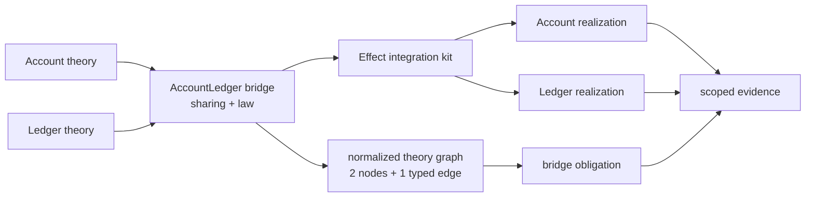

# Mission

BANG can relate Account and Ledger theories through explicit shared concepts, project one cross-theory balance law into an Effect integration harness, and explain an inconsistent pair of realizations with a domain-level counterexample.

## User journey

```text
Account theory + Ledger theory + AccountLedger bridge
  → Core decode and semantic validation
  → resolve qualified theory, sort, and operation references
  → identify shared AccountId and Balance concepts
  → normalize two theory nodes and one typed bridge edge
  → generate one cross-theory obligation
  → project two independent Effect model ports and one integration suite
  → a conforming Account/Ledger pair passes sampled checks
  → an inconsistent pair returns a minimized disagreement
  → evidence records scope, provenance, assumptions, and target weakening
```

Run `just preview`, inspect the generated Account/Ledger integration kit, and inspect `.bang/evidence/M005.json`.

## Semantic boundary



The theories own their local vocabularies. The bridge owns only the declared relationship between them. Sharing identifies two participant concepts as the same bridge-level concept; it is stronger than an alignment, which would record correspondence without identity.

The generated kit and test results are projections and observations. Effect, FastCheck, and TypeScript do not define the bridge law's meaning.

M005 materializes the checked relationship as one immutable undirected graph edge because sharing is symmetric. Core declaration IDs remain semantic identities; implementation graph indexes are derived handles and must not appear as stable source identities or evidence references.

## Core fragment

The two theories each declare independently represented concepts:

```text
theory Account {
  sort AccountId represented by Integer
  sort Balance represented by Integer
  balance : AccountId → Balance
}

theory Ledger {
  sort AccountId represented by Integer
  sort Balance represented by Integer
  balance : AccountId → Balance
}
```

The bridge has two named participants so all cross-theory references remain qualified:

```text
bridge AccountLedger {
  participant account : Account
  participant ledger : Ledger

  share AccountId = account.AccountId = ledger.AccountId
  share Balance = account.Balance = ledger.Balance

  law balancesAgree(accountId : AccountId):
    account.balance(accountId) = ledger.balance(accountId)
}
```

Canonical Core JSON represents:

- one `theoryBridge` declaration with stable identity;
- exactly two participant bindings for M005, each with a local alias and theory reference;
- named shared sorts whose members are qualified participant-sort references;
- laws with parameters over bridge-shared sorts;
- application terms whose operations are qualified by participant alias;
- equality propositions over terms that resolve to the same shared sort.

The textual form above is explanatory notation, not an M005 parser or normative surface language.

## Judgments

Let `B` bind participant alias `p` to theory `T`. Let bridge sharing `S` identify one sort from each participant.

```text
B(p) = T    sort s ∈ T
───────────────────────────────
B ⊢ p.s sort-reference

S = { left.s, right.t }
───────────────────────────────
B ⊢ left.s ≃ right.t : S

Γ(x) = S
───────────────────────────────
B ; Γ ⊢ x : S

B(p) = T    op : s₁ × … × sₙ → r ∈ T
B ; Γ ⊢ tᵢ : Sᵢ    p.sᵢ ∈ Sᵢ
───────────────────────────────
B ; Γ ⊢ p.op(t₁, …, tₙ) : Sᵣ  where p.r ∈ Sᵣ

B ; Γ ⊢ left : S    B ; Γ ⊢ right : S
───────────────────────────────
B ; Γ ⊢ left = right proposition
```

For M005, every sort crossing the bridge law must belong to an explicit sharing. Equal target representations alone do not identify independently declared theory concepts.

## Obligation and realization boundary

For every generated AccountId sample `a` in the configured run:

```text
Account.balance(a) = Ledger.balance(a)
```

The integration harness receives two independent realizations. It does not generate their business behavior.

```text
lawful pair:
  Account.balance(a) = a * 10
  Ledger.balance(a)  = a * 10

inconsistent pair:
  Account.balance(a) = a * 10
  Ledger.balance(a)  = a * 10 + 1
```

The broken pair should minimize to `accountId = 0n`, with observed Account balance `0n` and Ledger balance `1n`.

## Acceptance evidence

- valid Account, Ledger, and AccountLedger declarations decode and validate;
- unknown participant theories, unknown qualified sorts or operations, duplicate aliases, and law terms lacking the required sharing are rejected with bridge-level diagnostics;
- generated Effect source is deterministic and matches a committed snapshot;
- the normalized theory graph contains exactly the `AccountBalance` and `LedgerBalance` nodes and one `AccountLedger` edge carrying both shared-sort and bridge-law identities;
- the generated kit exposes two independent model ports and one bridge integration suite;
- the lawful pair passes 100 deterministic generated cases;
- the inconsistent pair returns a minimized counterexample containing bridge, law, participant, input, left observation, right observation, seed, shrink count, and replay path;
- diagnostics retain stable links to the bridge and both source theories;
- evidence classifies the run as `property-tested`, not proven or exhaustive;
- evidence records the unbounded Integer domain, TypeScript unsafe-boundary assumption, and any target weakening;
- M000–M004 evidence remains unchanged;
- `just verify` passes from a clean checkout and the protected GitHub run is green.

## Primary uncertainty

Can explicit participant qualification plus shared-sort identity support a useful cross-theory law without prematurely implementing a general module calculus, institution framework, or theory morphism language?

## Non-goals

- surface parsing or committing to `theory`, `module`, or `law` syntax;
- more than two theory participants in one bridge;
- import, extension, interpretation, translation, refinement, or mere alignment;
- arbitrary signature morphisms or categorical colimit composition;
- local Account or Ledger business laws beyond the bridge obligation;
- finite exhaustive evaluation, SMT, Alloy, TLA+, temporal logic, or proof certificates;
- state synchronization, persistence, transactions, effects, capabilities, or runtime monitors;
- deriving one realization from the other;
- a general obligation-dispatch or target-plugin framework.
- general graph composition, traversal policy, pathfinding, or cycle semantics beyond the one M005 sharing edge.

## Result

Completed on 2026-08-13. Core now represents two independently declared
theories and one qualified `theoryBridge` with explicit shared-sort identities.
Semantic checking rejects unknown participant theories, sorts, and operations,
duplicate participant aliases, and law terms whose sorts have not been shared.
The checked document normalizes into two Effect Graph nodes and one undirected
bridge edge while Core declaration IDs remain the stable semantic identities.

The Effect projection generates independent Account and Ledger model ports plus
one bridge property suite. At seed `20260813`, the lawful pair passed 100 sampled
cases. The inconsistent Ledger realization failed and shrank in one step to
`accountId = 0n`, where Account observed `0n` and Ledger observed `1n`; replay
path `0:0` and both observations are retained in the evidence manifest. The
manifest classifies this as `property-tested` and explicitly reports universal
agreement over all integers as unsupported by the TypeScript target.

The tracer uses Effect's native `FileSystem`, `Path`, and
`ChildProcessSpawner` requirements, `BunServices.layer`, and
`BunRuntime.runMain`; no project wrapper duplicates those platform services.
Implementation commit `53cd3b5` passed `just verify` from a detached clean
worktree after `bun install --frozen-lockfile --ignore-scripts` installed 290
packages.

Hosted acceptance: [GitHub Actions run 31738574761](https://github.com/phibkro/bang-project/actions/runs/31738574761).
